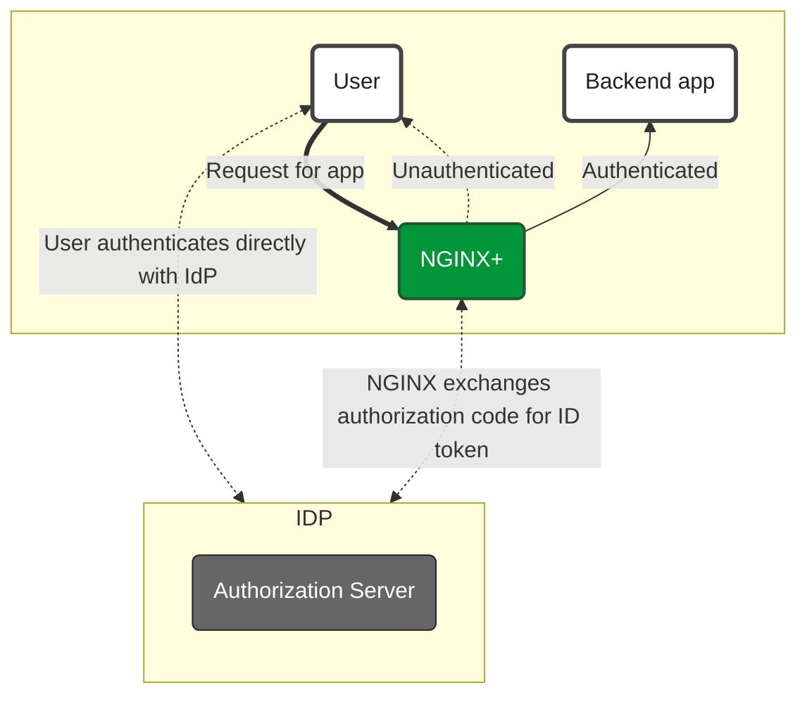
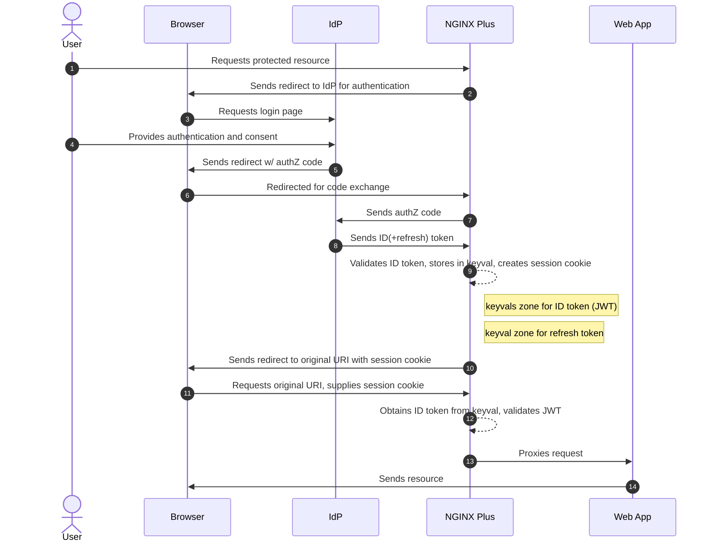

# nginx-openid-connect

Reference implementation of NGINX Plus as relying party for OpenID Connect authentication

## Description

This repository describes how to enable OpenID Connect integration for [NGINX Plus](https://www.nginx.com/products/nginx/). The solution depends on NGINX Plus components ([auth_jwt module](http://nginx.org/en/docs/http/ngx_http_auth_jwt_module.html) and [key-value store](http://nginx.org/en/docs/http/ngx_http_keyval_module.html)) and as such is not suitable for [open source NGINX](http://www.nginx.org/en).


`Figure 1. High level components of an OpenID Connect environment`

This implementation assumes the following environment:

  * The identity provider (IdP) supports OpenID Connect 1.0
  * The authorization code flow is in use
  * NGINX Plus is configured as a relying party
  * The IdP knows NGINX Plus as a confidential client or a public client using PKCE

With this environment, both the client and NGINX Plus communicate directly with the IdP at different stages during the initial authentication event.


`Figure 2. OpenID Connect authorization code flow protocol`

NGINX Plus is configured to perform OpenID Connect authentication. Upon a first visit to a protected resource, NGINX Plus initiates the OpenID Connect authorization code flow and redirects the client to the OpenID Connect provider (IdP). When the client returns to NGINX Plus with an authorization code, NGINX Plus exchanges that code for a set of tokens by communicating directly with the IdP.

The ID Token received from the IdP is [validated](https://openid.net/specs/openid-connect-core-1_0.html#IDTokenValidation). NGINX Plus then stores the ID token in the key-value store, issues a session cookie to the client using a random string, (which becomes the key to obtain the ID token from the key-value store) and redirects the client to the original URI requested prior to authentication.

Subsequent requests to protected resources are authenticated by exchanging the session cookie for the ID Token in the key-value store. JWT validation is performed on each request, as normal, so that the ID Token validity period is enforced.

For more information on OpenID Connect and JWT validation with NGINX Plus, see [Authenticating Users to Existing Applications with OpenID Connect and NGINX Plus](https://www.nginx.com/blog/authenticating-users-existing-applications-openid-connect-nginx-plus/).

### Client Authentication Methods

When configuring NGINX Plus as an OpenID Connect client, it supports multiple client authentication methods:

* **client_secret_basic**:
  * The `client_id` and `client_secret` are sent in the Authorization header as a Base64-encoded string.
* **client_secret_post**:
  * The `client_id` and `client_secret` are sent in the body of the POST request.
* **none** (PKCE):
  * For public clients that cannot protect a client secret, the `code_verifier` is used instead of a `client_secret`.
  * PKCE is particularly useful for mobile and single-page applications.

### Access Tokens

[Access tokens](https://openid.net/specs/openid-connect-core-1_0.html#AccessTokenDisclosure) are used in token-based authentication to allow OIDC client to access a protected resource on behalf of the user. NGINX Plus receives an access token after a user successfully authenticates and authorizes access, and then stores it in the key-value store. NGINX Plus can pass that token on the HTTP Authorization header as a [Bearer token](https://oauth.net/2/bearer-tokens/) for every request that is sent to the downstream application.

> **Note:** NGINX Plus does not verify the validity of the access token on each request, as we do with the ID token, so we cannot know if the access token has already expired or not. So, if access token lifetime is less than the ID token lifetime, you have to use the `proxy_intercept_errors on` directive, which will intercept and redirect `401 Unauthorized` responses to NGINX in order to refresh the access token.

### Refresh Tokens

If a [refresh token](https://openid.net/specs/openid-connect-core-1_0.html#RefreshTokens) was received from the IdP then it is also stored in the key-value store. When validation of the ID Token fails (typically upon expiry) then NGINX Plus sends the refresh token to the IdP. If the user's session is still valid at the IdP then a new ID token is received, validated, and updated in the key-value store. The refresh process is seamless to the client.

### Logout

Requests made to the `/logout` location invalidate both the ID token, access token and refresh token by erasing them from the key-value store. Therefore, subsequent requests to protected resources will be treated as a first-time request and send the client to the IdP for authentication. Note that the IdP may issue cookies such that an authenticated session still exists at the IdP.

#### RP-Initiated OIDC Logout

RP-initiated logout is supported according to [OpenID Connect RP-Initiated Logout 1.0](https://openid.net/specs/openid-connect-rpinitiated-1_0.html). This behavior is controlled by the `$oidc_end_session_endpoint` variable.

### Multiple IdPs

Where NGINX Plus is configured to proxy requests for multiple websites or applications, or user groups, these may require authentication by different IdPs. Separate IdPs can be configured, with each one matching on an attribute of the HTTP request, e.g. hostname or part of the URI path.

> **Note:** When validating OpenID Connect tokens, NGINX Plus can be configured to read the signing key (JWKS) from disk, or a URL. When using multiple IdPs, each one must be configured to use the same method. It is not possible to use a mix of both disk and URLs for the `map…$oidc_jwt_keyfile` variable.

## Installation

Start by [installing NGINX Plus](https://docs.nginx.com/nginx/admin-guide/installing-nginx/installing-nginx-plus/). In addition, the [NGINX JavaScript module](https://www.nginx.com/blog/introduction-nginscript/) (njs) is required for handling the interaction between NGINX Plus and the OpenID Connect provider (IdP). Install the njs module after installing NGINX Plus by running one of the following:

`$ sudo apt install nginx-plus-module-njs` for Debian/Ubuntu

`$ sudo yum install nginx-plus-module-njs` for CentOS/RHEL

The njs module needs to be loaded by adding the following configuration directive near the top of **nginx.conf**.

```nginx
load_module modules/ngx_http_js_module.so;
```

Finally, create a clone of the GitHub repository.

`$ git clone https://github.com/nginxinc/nginx-openid-connect`

> **Note:** There is a branch for each NGINX Plus release. Switch to the correct branch to ensure compatibility with the features and syntax of each release. The main branch works with the most recent NGINX Plus and JavaScript module releases.

All files can be copied to **/etc/nginx/conf.d**

### Non-standard directories
The GitHub repository contains [`include`](http://nginx.org/en/docs/ngx_core_module.html#include) files for NGINX configuration, and JavaScript code for token exchange and initial token validation. These files are referenced with a relative path (relative to /etc/nginx). If NGINX Plus is running from a non-standard location then copy the files from the GitHub repository to `/path/to/conf/conf.d` and use the `-p` flag to start NGINX with a prefix path that specifies the location where the configuration files are located.

```shell
$ nginx -p /path/to/conf -c /path/to/conf/nginx.conf
```

### Running in containers
This implementation is suitable for running in a container provided that the [base image](https://docs.nginx.com/nginx/admin-guide/installing-nginx/installing-nginx-docker/) includes the NGINX JavaScript module. The GitHub repository is designed to facilitate testing with a container by binding the cloned repository to a mount volume on the container.

```shell
$ cd nginx-openid-connect
$ docker run -d -p 8010:8010 -v $PWD:/etc/nginx/conf.d nginx-plus nginx -g 'daemon off; load_module modules/ngx_http_js_module.so;'
```

### Running behind another proxy or load balancer
When NGINX Plus is deployed behind another proxy, the original protocol and port number are not available. NGINX Plus needs this information to construct the URIs it passes to the IdP and for redirects. By default NGINX Plus looks for the X-Forwarded-Proto and X-Forwarded-Port request headers to construct these URIs.

## Configuring your IdP

  * Create an OpenID Connect client to represent your NGINX Plus instance
    * Choose the **authorization code flow**
    * Set the **redirect URI** to the address of your NGINX Plus instance (including the port number), with `/_codexch` as the path, e.g. `https://my-nginx.example.com:443/_codexch`
    * Ensure NGINX Plus is configured as a confidential client (with a client secret) or a public client (with PKCE S256 enabled)
    * If NGINX Plus is configured as a confidential client, choose the appropriate authentication method: **client_secret_basic** or **client_secret_post**.
    * Make a note of the `client ID` and `client secret` if set
    * Set the **post logout redirect URI** to the address of your NGINX Plus instance (including the port number), with `/_logout` as the path, e.g. `https://my-nginx.example.com:443/_logout`

  * If your IdP supports OpenID Connect Discovery (usually at the URI `/.well-known/openid-configuration`) then use the `configure.sh` script to complete configuration. In this case you can skip the next section. Otherwise:
    * Obtain the URL for `jwks_uri` or download the JWK file to your NGINX Plus instance
    * Obtain the URL for the **authorization endpoint**
    * Obtain the URL for the **token endpoint**
    * Obtain the URL for the **end session endpoint**

## Configuring NGINX Plus

Configuration can typically be completed automatically by using the `configure.sh` script.

Manual configuration involves reviewing the following files so that they match your IdP(s) configuration.

  * **openid_connect_configuration.conf** - this contains the primary configuration for one or more IdPs in `map{}` blocks
    * Modify all of the `map…$oidc_` blocks to match your IdP configuration
    * Modify the URI defined in `map…$oidc_logout_redirect` to specify an unprotected resource to be displayed after requesting the `/logout` location
    * Set a unique value for `$oidc_hmac_key` to ensure nonce values are unpredictable
    * If NGINX Plus is deployed behind another proxy or load balancer, modify the `map…$redirect_base` and `map…$proto` blocks to define how to obtain the original protocol and port number.

  * **frontend.conf** - this is the reverse proxy configuration
    * Modify the upstream group to match your backend site or app
    * Configure the preferred listen port and [enable SSL/TLS configuration](https://docs.nginx.com/nginx/admin-guide/security-controls/terminating-ssl-http/)
    * Modify the severity level of the `error_log` directive to suit the deployment environment
    * Comment/uncomment the `auth_jwt_key_file` or `auth_jwt_key_request` directives based on whether `$oidc_jwt_keyfile` is a file or URI, respectively
    * Uncomment the `proxy_set_header Authorization "Bearer $access_token"` directive if you want to pass access/bearer token in HTTP header to the protected backend/upstream
    * Uncoment the `proxy_intercept_errors on` directive if the access token lifetime is less than the ID token lifetime

  * **openid_connect.server_conf** - this is the NGINX configuration for handling the various stages of OpenID Connect authorization code flow
    * No changes are usually required here
    * Modify the `resolver` directive to match a DNS server that is capable of resolving the IdP defined in `$oidc_token_endpoint` and `$oidc_end_session_endpoint`
    * If using [`auth_jwt_key_request`](http://nginx.org/en/docs/http/ngx_http_auth_jwt_module.html#auth_jwt_key_request) to automatically fetch the JWK file from the IdP then modify the validity period and other caching options to suit your IdP

  * **openid_connect.js** - this is the JavaScript code for performing the authorization code exchange and nonce hashing
    * No changes are required unless modifying the code exchange or validation process

### Configuring the Key-Value Store

The key-value store is used to maintain persistent storage for ID tokens and refresh tokens. The default configuration should be reviewed so that it suits the environment. This is part of the advanced configuration in **openid_connect_configuration.conf**.

```nginx
keyval_zone zone=oidc_id_tokens:1M     state=/var/lib/nginx/state/oidc_id_tokens.json     timeout=1h;
keyval_zone zone=oidc_access_tokens:1M state=/var/lib/nginx/state/oidc_access_tokens.json timeout=1h;
keyval_zone zone=refresh_tokens:1M     state=/var/lib/nginx/state/refresh_tokens.json     timeout=8h;
keyval_zone zone=oidc_pkce:128K timeout=90s;
```

Each of the `keyval_zone` parameters are described below.

  * **zone** - Specifies the name of the key-value store and how much memory to allocate for it. Each session will typically occupy 1-2KB, depending on the size of the tokens, so scale this value to exceed the number of unique users that may authenticate.

  * **state** (optional) - Specifies where all of the ID Tokens in the key-value store are saved, so that sessions will persist across restart or reboot of the NGINX host. The NGINX Plus user account, typically **nginx**, must have write permission to the directory where the state file is stored. Consider creating a dedicated directory for this purpose.

  * **timeout** - Expired tokens are removed from the key-value store after the `timeout` value. This should be set to value slightly longer than the JWT validity period. JWT validation occurs on each request, and will fail when the expiry date (`exp` claim) has elapsed. If JWTs are issued without an `exp` claim then set `timeout` to the desired session duration. If JWTs are issued with a range of validity periods then set `timeout` to exceed the longest period.

  * **sync** (optional) - If deployed in a cluster, the key-value store may be synchronized across all instances in the cluster, so that all instances are able to create and validate authenticated sessions. Each instance must be configured to participate in state sharing with the [zone_sync module](http://nginx.org/en/docs/stream/ngx_stream_zone_sync_module.html) and by adding the `sync` parameter to the `keyval_zone` directives above. If deployed in [NGINXaaS for Azure](https://docs.nginx.com/nginxaas/azure/overview/overview/), **sync** is a must configuration. Check [NGINXaaS OIDC](https://docs.nginx.com/nginxaas/azure/quickstart/security-controls/oidc/) for more details.

## Session Management

The [NGINX Plus API](http://nginx.org/en/docs/http/ngx_http_api_module.html) is enabled in **openid_connect.server_conf** so that sessions can be monitored. The API can also be used to manage the current set of active sessions.

To query the current sessions in the key-value store:

```shell
$ curl localhost:8010/api/6/http/keyvals/oidc_id_tokens
```

To delete a single session:

```shell
$ curl -iX PATCH -d '{"<session ID>":null}' localhost:8010/api/6/http/keyvals/oidc_id_tokens
$ curl -iX PATCH -d '{"<session ID>":null}' localhost:8010/api/6/http/keyvals/oidc_access_tokens
$ curl -iX PATCH -d '{"<session ID>":null}' localhost:8010/api/6/http/keyvals/refresh_tokens
```

To delete all sessions:

```shell
$ curl -iX DELETE localhost:8010/api/6/http/keyvals/oidc_id_tokens
$ curl -iX DELETE localhost:8010/api/6/http/keyvals/oidc_access_tokens
$ curl -iX DELETE localhost:8010/api/6/http/keyvals/refresh_tokens
```

## Real time monitoring

The **openid_connect.server_conf** file defines several [`status_zone`](http://nginx.org/en/docs/http/ngx_http_api_module.html#status_zone) directives to collect metrics about OpenID Connect activity and errors. Separate metrics counters are recorded for:

 * **OIDC start** - New sessions are counted here. See step 2 in Figure 2, above. Success is recorded as a 3xx response.

 * **OIDC code exchange** - Counters are incremented here when the browser returns to NGINX Plus after authentication. See steps 6-10 in Figure 2, above. Success is recorded as a 3xx response.

 * **OIDC logout** - Requests to the /logout URI are counted here. Success is recorded as a 3xx response.

 * **OIDC error** - Counters are incremented here when errors in the code exchange process are actively detected. Typically there will be a corresponding error_log entry.

 To obtain the current set of metrics:

 ```shell
$ curl localhost:8010/api/6/http/location_zones
```

In addition, the [NGINX Plus Dashboard](https://docs.nginx.com/nginx/admin-guide/monitoring/live-activity-monitoring/#dashboard) can be configured to visualize the monitoring metrics in a GUI.

## Troubleshooting

Any errors generated by the OpenID Connect flow are logged to the error log, `/var/log/nginx/error.log`. Check the contents of this file as it may include error responses received by the IdP. The level of detail recorded can be modified by adjusting the severity level of the `error_log` directive.

  * **400 error from IdP**
    * This is typically caused by incorrect configuration related to the client ID and client secret.
    * Check the values of the `map…$oidc_client` and `map…$oidc_client_secret` variables against the IdP configuration.

  * **500 error from nginx after successful authentication**
    * Check for `could not be resolved` and `empty JWK set while sending to client` messages in the error log. This is common when NGINX Plus cannot reach the IdP's `jwks_uri` endpoint.
    * Check the `map…$oidc_jwt_keyfile` variable is correct.
    * Check the `resolver` directive in **openid_connect.server_conf** is reachable from the NGINX Plus host.
    * Check for `OIDC authorization code sent but token response is not JSON.` messages in the error log. This is common when NGINX Plus cannot decompress the IdP's response. Add the following configuration snippet to the `/_jwks_uri` and `/_token` locations to **openid_connect.server_conf**:
```nginx
    proxy_set_header Accept-Encoding "gzip";
```

  * **Authentication is successful but browser shows too many redirects**
    * This is typically because the JWT sent to the browser cannot be validated, resulting in 'authorization required' `401` response and starting the authentication process again. But the user is already authenticated so is redirected back to NGINX,  hence the redirect loop.
    * Avoid using `auth_jwt_require` directives in your configuration because this can also return a `401` which is indistinguishable from missing/expired JWT.
    * Check the error log `/var/log/nginx/error.log` for JWT/JWK errors.
    * Ensure that the JWK file (`map…$oidc_jwt_keyfile` variable) is correct and that the nginx user has permission to read it.

  * **Logged out but next request does not require authentication**
    * This is typically caused by the IdP issuing its own session cookie(s) to the client. NGINX Plus sends the request to the IdP for authentication and the IdP immediately sends back a new authorization code because the session is still valid.
    * Check your IdP configuration if this behavior is not desired.

  * **Failed SSL/TLS handshake to IdP**
    * Indicated by error log messages including `peer closed connection in SSL handshake (104: Connection reset by peer) while SSL handshaking to upstream`.
    * This can occur when the IdP requires Server Name Indication (SNI) information as part of the TLS handshake. Additional configuration is required to satisfy this requirement.
    * Edit **openid_connect.server_conf** and for each of the `/_jwks_uri`, `/_token`, and `/_refresh` locations, add the following configuration snippet:
```nginx
proxy_set_header Host <IdP hostname>;
proxy_ssl_name        <IdP hostname>;
```

  * **Invalid access token**
    Users may receive a `401` response with an optional "Invalid token" message despite successful authentication. There are several reasons why an OIDC access token might not be accepted by the upstream server, even if it has not expired:
    * Incorrect backend server configuration. NGINX Plus sends the bearer token in the HTTP Authorization header, but the backend application expects it in a specific cookie.
    * The token has been tampered with. OIDC access tokens are digitally signed by the authorization server to ensure their authenticity. If the token has been modified in any way, the signature will no longer be valid, and the token will be considered invalid.
    > **Note:** The scope of an OIDC access token is independent of its validity. Even if an OIDC access token is not expired and has not been revoked, it may still be considered invalid if it does not have the necessary scope for the requested action. Please check the `$oidc_scopes` variable in the `openid_connect_configuration.conf` file.

## Support

This reference implementation for OpenID Connect is supported for NGINX Plus subscribers.

## Changelog

  * **R15** Initial release of OpenID Connect reference implementation
  * **R16** Added support for opaque session tokens using key-value store
  * **R17** Configuration now supports JSON Web Key (JWK) set to be obtained by URI
  * **R18** Opaque session tokens now used by default. Added support for refresh tokens. Added `/logout` location.
  * **R19** Minor bug fixes
  * **R22** Separate configuration file, supports multiple IdPs. Configurable scopes and cookie flags. JavaScript is imported as an indepedent module with `js_import`. Container-friendly logging. Additional metrics for OIDC activity.
  * **R23** PKCE support. Added support for deployments behind another proxy or load balancer.
  * **R28** Access token support. Added support for access token to authorize NGINX to access protected backend.
  * **R32** Added support for `client_secret_basic` client authentication method.
