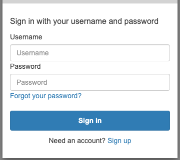
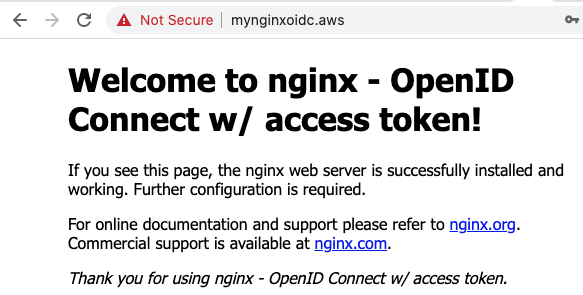
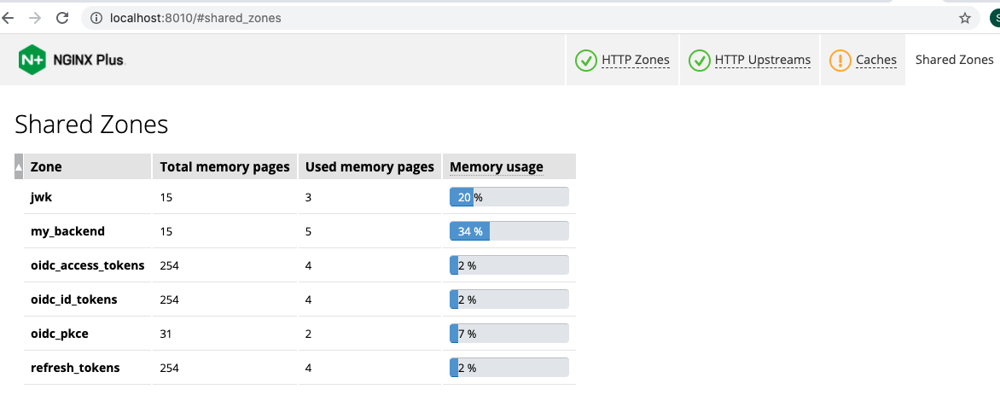

# NGINX OpenID Connect - Access Token

This directory provides the examples of [NGINX configuration](./conf/conf.d), [Dockerfile](./Dockerfile) and [OIDC codebase](./conf/conf.d/oidc.js) that contain additional access token features by refactoring the [nginx-openid-connect](https://github.com/nginxinc/nginx-openid-connect).

## Prerequisites
- [Configure your IdP](https://github.com/nginxinc/nginx-openid-connect/#configuring-your-idp).
- Prepare your certificates and update the followings if you want to enable SSL.
  - [./auxfiles/mysample.crt](./auxfiles/mysample.crt)
  - [./auxfiles/mysample.key](./auxfiles/mysample.key)
  - The files would be copied into your Docker container if you update them.
  - You can manually configure `pem` file in the [frontend.conf](./conf/conf.d/frontend.conf) if you want.
- Update OIDC configuration in your NGINX Plus config files:
  - [./conf/conf.d/frontend.conf](./conf/conf.d/frontend.conf)
    - Update server name, port and SSL if you want.
    - Remove `X-` variables if you want as they are for temporary testing.
  - [./conf/conf.d/oidc_common.conf](./conf/conf.d/oidc_common.conf)
    - [$oidc_authz_endpoint](./conf/conf.d/oidc_common.conf#L7)
    - [$oidc_token_endpoint](./conf/conf.d/oidc_common.conf#L14)
    - [$oidc_jwt_keyfile](./conf/conf.d/oidc_common.conf#L20)
    - [$oidc_client](./conf/conf.d/oidc_common.conf#L26)
    - [$oidc_client_secret](./conf/conf.d/oidc_common.conf#L36)
- Update a [Dockerfile](./Dockerfile) if you need anything.
  - The `vi` is added for you to easily edit `nginx.conf` for your local testing.
- Edit `/etc/hosts` file with the server name like:
  ```
  127.0.0.1      mynginxoidc.aws
  ```
- Download your version of the nginx-repo.crt and nginx-repo.key files via the [customer portal](https://cs.nginx.com/?_ga=2.268586425.912746048.1620625839-85838359.1596947109).


## Local NGINX Plus Setup

- Create a Docker image called `nginxoidc`:
  ```bash
  $ docker build --no-cache -t nginxoidc .
  ```

- Execute the following command if you want to stop and remove the container:
  ```bash
  $ docker stop my-nginx; docker rm my-nginx
  ```

- Create and run a container named my-nginx based on this image:
  ```bash
  $ docker run  --name my-nginx                  \
                -p 80:80 -p 443:443 -p 8010:8010 \
                -d nginxoidc
  ```


## Access Web Page w/ NGINX OIDC
- Open your web browser and connect to the URL like `https://mynginxoidc.aws/`.
- Enter the user name and password that are registered in your IdP.

  

- Check if you could successfully find the following web page based on NGINX OIDC handshaking.

  


## Query Current Sessions: ID / Access Tokens
The [NGINX Plus API](http://nginx.org/en/docs/http/ngx_http_api_module.html) is enabled in oidc_server.conf so that sessions can be monitored. The API can also be used to manage the current set of active sessions.

It is also defined in status-api.conf for you to easily check the status without additional certs arguments in the API request via `curl`.

**To query the current ID Tokens** in the key-value store:
```
$ curl localhost:8010/api/6/http/keyvals/oidc_id_tokens
```

**To query the current Access Tokens** in the key-value store:
```
$ curl localhost:8010/api/6/http/keyvals/oidc_access_tokens
```

**To delete a single session**:
```
$ curl -iX PATCH -d '{"<session ID>":null}' localhost:8010/api/6/http/keyvals/oidc_id_tokens
$ curl -iX PATCH -d '{"<session ID>":null}' localhost:8010/api/6/http/keyvals/oidc_access_tokens
$ curl -iX PATCH -d '{"<session ID>":null}' localhost:8010/api/6/http/keyvals/refresh_tokens
```

**To delete all sessions**:
```
$ curl -iX DELETE localhost:8010/api/6/http/keyvals/oidc_id_tokens
$ curl -iX DELETE localhost:8010/api/6/http/keyvals/oidc_access_tokens
$ curl -iX DELETE localhost:8010/api/6/http/keyvals/refresh_tokens
```

**To check shared zones**:




## Reference
- [NGINX OpenID Connect](https://github.com/shawnhankim/nginx-openid-connect)
- [Enabling Single Sign-On for Proxied Applications](https://docs.nginx.com/nginx/deployment-guides/single-sign-on/)
- [OpenID Connect Core 1.0](https://openid.net/specs/openid-connect-core-1_0.html)
  - [OIDC Token Request](http://openid.net/specs/openid-connect-core-1_0.html#TokenRequest)
  - [Refresh Access Token](https://openid.net/specs/openid-connect-core-1_0.html#RefreshingAccessToken)
  - [Refresh Error Response](https://openid.net/specs/openid-connect-core-1_0.html#RefreshErrorResponse)
  - [Successful Refresh Response](https://openid.net/specs/openid-connect-core-1_0.html#RefreshTokenResponse)
  - [ID Token Validation](https://openid.net/specs/openid-connect-core-1_0.html#IDTokenValidation)
  - [Access Token Validation](https://openid.net/specs/openid-connect-core-1_0.html#CodeFlowTokenValidation)
- [RFC7519: JWT Claims](https://datatracker.ietf.org/doc/html/rfc7519#page-8)
