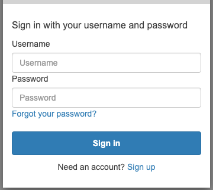
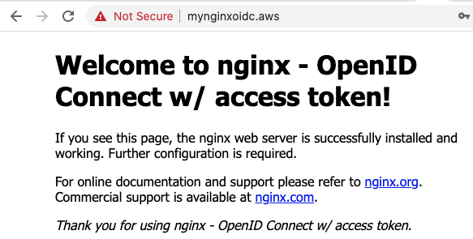
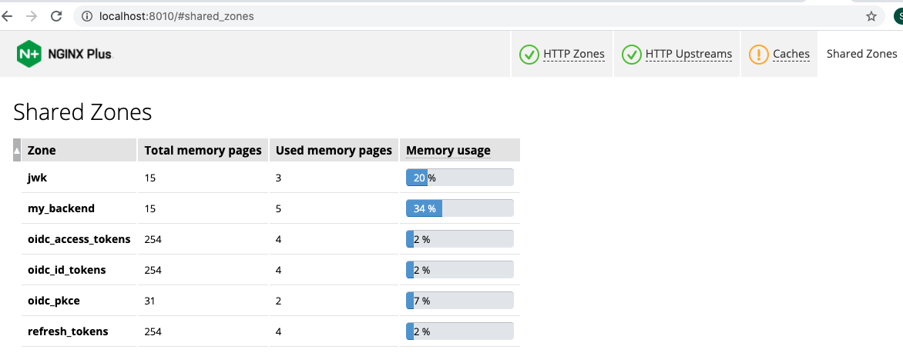
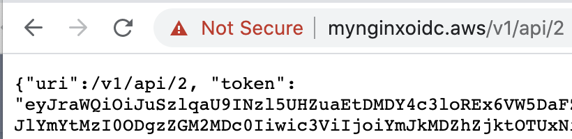

# NGINX OIDC - Access Web, ID Token, Access Token
This doc provides how to access web page, how to retrieve ID and access token, and how to pass access token to the proxied backend services using NGINX OIDC RP implementation.


## Access Web Page with NGINX OIDC

- Open your web browser and connect to the URL like `https://mynginxoidc.aws/`.
- Enter the user name and password that are registered in your IdP.

  

- Check if you could successfully find the following web page based on NGINX OIDC handshaking.

  


## Query Current Sessions

The [NGINX Plus API](http://nginx.org/en/docs/http/ngx_http_api_module.html) is enabled in oidc_server.conf so that sessions can be monitored. The API can also be used to manage the current set of active sessions.

It is also defined in status-api.conf for you to easily check the status without additional certs arguments in the API request via `curl`.

**To query the current ID Tokens** in the key-value store:
```
$ curl localhost:8010/api/6/http/keyvals/oidc_id_tokens
```

**To query the current Access Tokens** in the key-value store:
```
$ curl localhost:8010/api/6/http/keyvals/oidc_access_tokens
```

**To delete a single session**:
```
$ curl -iX PATCH -d '{"<session ID>":null}' localhost:8010/api/6/http/keyvals/oidc_id_tokens
$ curl -iX PATCH -d '{"<session ID>":null}' localhost:8010/api/6/http/keyvals/oidc_access_tokens
$ curl -iX PATCH -d '{"<session ID>":null}' localhost:8010/api/6/http/keyvals/refresh_tokens
```

**To delete all sessions**:
```
$ curl -iX DELETE localhost:8010/api/6/http/keyvals/oidc_id_tokens
$ curl -iX DELETE localhost:8010/api/6/http/keyvals/oidc_access_tokens
$ curl -iX DELETE localhost:8010/api/6/http/keyvals/refresh_tokens
```

**To check shared zones**:




## Call Proxied Backend Service with Access Token

**To call proxied API w/ bearer access token from cookie via browser:**
- Prerequisite: Login first through your IdP.
- Call one of your APIs like `https://{hostname}/v1/api/2`:
  

**To call proxied API w/ bearer access token without cookie via CURL:**
- Find your access token and store it to `sample.jwt`.
  ```
  $ curl -H "Authorization: Bearer `cat sample.jwt`" -k -v https://{hostname}/v1/api/3
  {"uri":/v1/api/3, "token": "xxx.xxxx.xxxx"}
  ```
- If you could find `token` value like `"token": "xxx.xxxx.xxxx"` in the response, it means the token is successfully passed in the header of API endpoint of proxied backend service.
