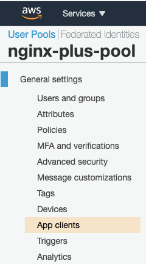
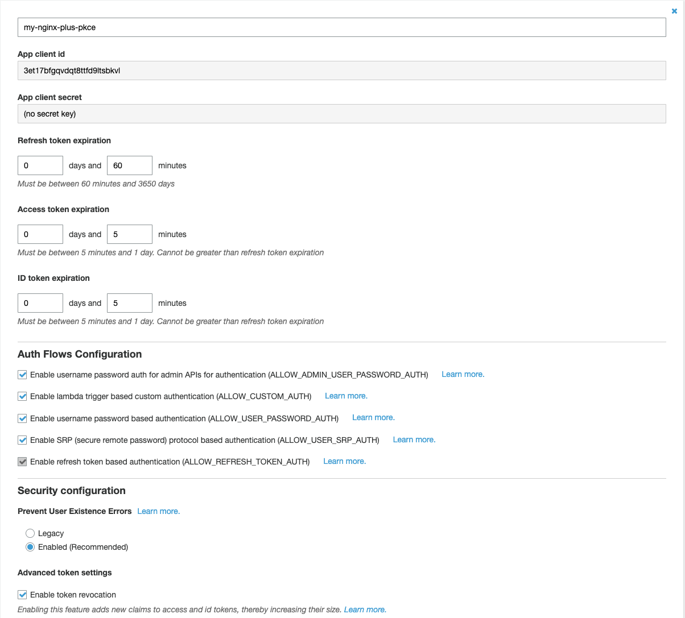
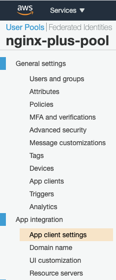
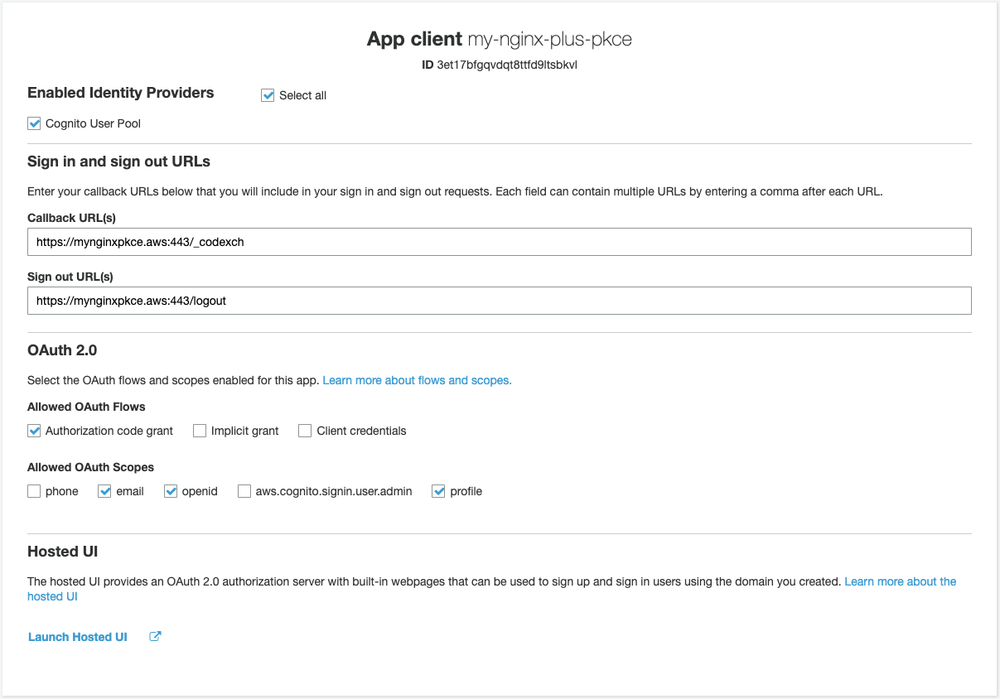

# NGINX OIDC - PKCE w/ Amazon Cognito, OneLogin, Okta
This doc provides how to configure and test PKCE in IdPs and NGINX.conf in NGINX Plus.

## Amazon Cognito: PKCE Setup
Let's set up PKCE into your application with AWS Cognito.

> **Select `App clients` under `General Settings` of `User Pools`:**

  

> **Create App Clients:**

You should not create credentials for setting up PKCE.

  

> **Select `App client settings` under `App integration` of `User Pools`:**

  

> **Set Up Callback URL and OAuth Flows & Scopes:**

  

## OneLogin: PKCE Setup

## Okta: PKCE Setup

## NGINX Plus: PKCE Setup

## Reference
