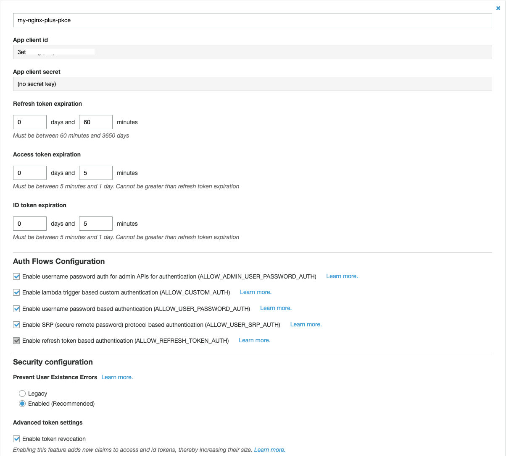
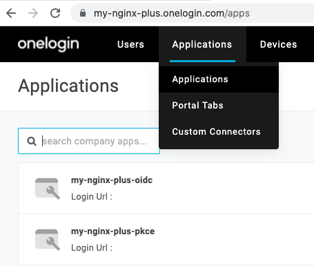
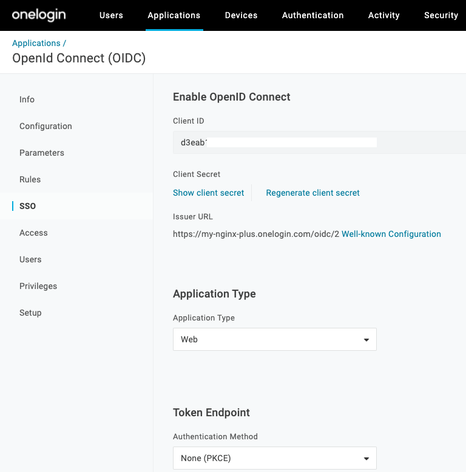
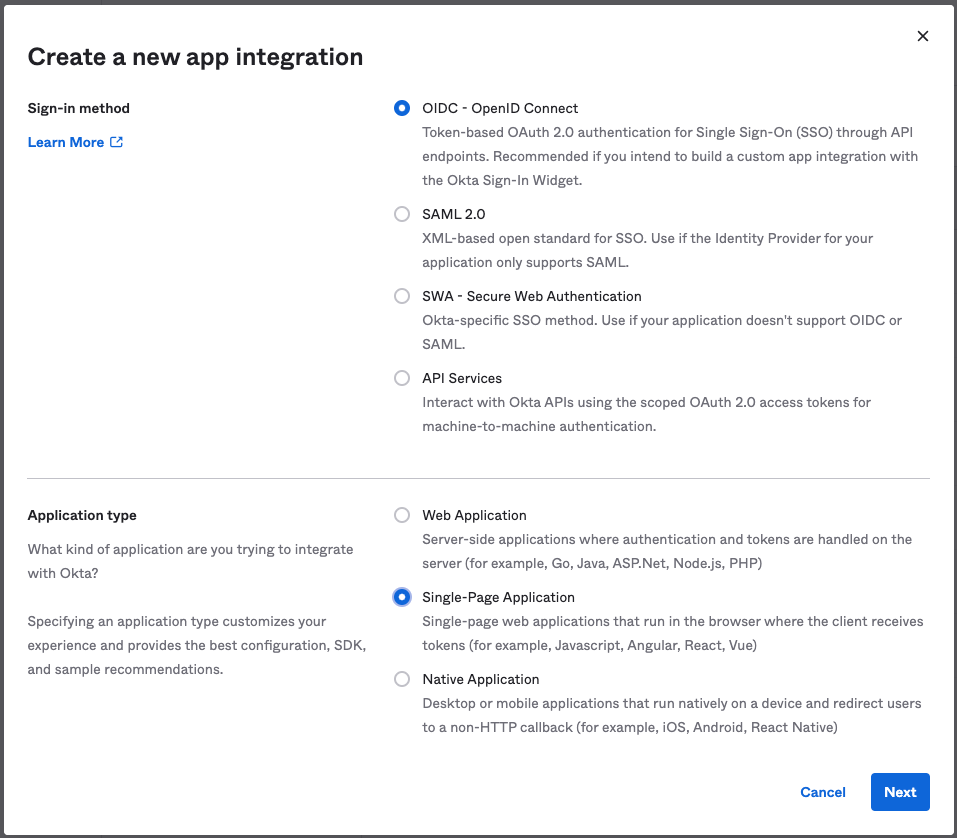
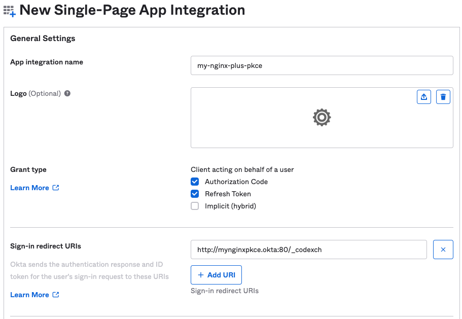
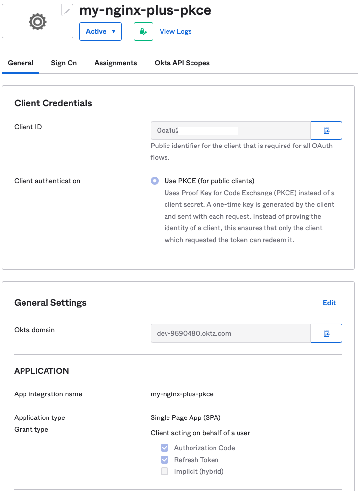

# NGINX OIDC - PKCE w/ Amazon Cognito, OneLogin, Okta
This doc provides how to configure and test PKCE in IdPs and NGINX.conf in NGINX Plus.

- [PKCE Setup with Amazon Cognito](#pkce-setup-with-amazon-cognito)
- [PKCE Setup with OneLogin](#pkce-setup-with-oneLogin)
- [PKCE Setup with Okta](#pkce-setup-with-okta)
- [PKCE Setup with NGINX Plus](#pkce-setup-with-nginx-plus)
- [Let's Access Web with PKCE](#lets-access-web-with-pkce)

## PKCE Setup with Amazon Cognito
Let's set up PKCE into your application with AWS Cognito.

> **Select `App clients` under `General Settings` of `User Pools`:**

  

> **Create App Clients:**

Note that you should not create credentials for setting up PKCE when creating an app client.

  

> **Select `App client settings` under `App integration` of `User Pools`:**

  

> **Set Up Callback URL and OAuth Flows & Scopes:**

  


## PKCE Setup with OneLogin
Let's set up PKCE into your application with OneLogin. Note that `redirect URIs` must be also set up.

> **Add an app and select one of applications (i.e. `my-nginx-plus-pkce`) under the menu of `Applications`:**

  

> **Select `None(PKCE)` from the dropbox of `Application Type` under `SSO` Menu:**

  


## PKCE Setup with Okta
Let's set up PKCE into your application with Okta.

> **Create a new app integration via the menu of `Applications`**:

  In this example, let's select `Single-Page Application` in the `Application Type`. Note that the `Web Application` doesn't support PKCE.

  

> **Set Up `Grant type` and `Sign-in recirect URIs`**:

  Note that the `Authorization Code` must be set up. The `recirect URIs` is same as `Callback URL` setup in Amazon Cognito.

  

> **Selet one of your applications (e.g. `my-nginx-plus-pkce`)**:

  You could find the Client authentization is `Use PKCE(for public clients)` as the following configuration when selecting your app.
  
  


## PKCE Setup with NGINX Plus

> **Client ID Setup**:
  
  Let's copy your client ID from the each IDP's setup, and either create [/etc/nginx/conf.d/oidc_credentials.conf](../../build-context/nginx/conf.d/oidc_credentials.conf) with the following configurations or paste them it to the file of [etc/nginx/conf.d/oidc_common.conf](../../build-context/nginx/conf.d/oidc_common.conf).
  Note that the `$oidc_client` directive isn't needed for PKCE workflow.

  ```nginx
  map $host $oidc_client {
      mynginxpkce.aws         "your client ID";
      mynginxpkce.one         "your client ID";
      mynginxpkce.okta        "your client ID";
  }
  ```

> **PKCE Setup**:

  Let's set `1` to each `$host` of the `$oidc_pkce_enable` in the [etc/nginx/conf.d/oidc_common.conf](../../build-context/nginx/conf.d/oidc_common.conf). Note that other configurations (e.g. ) are same as the [prerequisites](../../docs/prerequisites.md#update-oidc-configurations).
  
  ```nginx
  map $host $oidc_pkce_enable {
      mynginxpkce.aws         1;
      mynginxpkce.one         1;
      mynginxpkce.okta        1;
  }
  ```

> **Server Setup**:

  You could simply set up your server by adding port, server name, certificates (optional, but, recommended in production), and by including sample configurations as the following configuration in the [/etc/nginx/conf.d/sample_frontend_api_server.conf](../../build-context/nginx/conf.d/sample_frontend_api_server.conf):

  ```nginx
  server {
      listen 80; # Use SSL/TLS in production
      server_name mynginxpkce.okta;

      include conf.d/sample_location_frontend.conf;
      include conf.d/sample_location_api.conf;
  }
  ```  

## Let's Access Web with PKCE
You have set up PKCE with multiple IDPs and NGINX Plus. Now you are ready to start checking if you could access your page with the PKCE setup. 

Given the above setup, you could just type your host name in your web browser and test it if it works. The process is same as [this link](../01-access-web-and-tokens/README.md#access-web-page-with-nginx-oidc).

