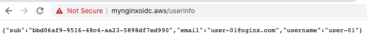

# NGINX OIDC - User Information
This doc provides how to retrieve user information using NGINX OIDC RP implementation. You could find two types of request based on your needs as follows.

Use Case | Header                       | URI
---------|------------------------------|-----------------------------
I        | Cookie + Bearer Access Token | `{hostName}/userinfo`
II       | Only Bearer Token            | `{hostName}/user_info`


## `Use Case I`: Retrieve User Info w/ Cookie + Bearer Access Token
Do you want to request user information using bearer access token and cookie after logging-in via IdP in your web browser? 

For this use case, you could find the [location block of /userinfo](../../build-context/nginx/conf.d/oidc_server.conf#L80) in `/etc/nginx/conf.d/oidc_server.conf` of your data plane to retrieve the info.

- [Access web page based on IDP login](../01-access-web-and-tokens/README.md#access-web-page-with-nginx-oidc)
- To retrieve user information in the web page:
  


## `Use Case II`: Retrieve User Info w/ only Bearer Access Token
Do you want to request user information using bearer access token without cookie via `Postman` or `CURL`?

For this use case, you could find the [location block of /user_info](../../build-context/nginx/conf.d/oidc_server.conf#L89) in `/etc/nginx/conf.d/oidc_server.conf` of your data plane to retrieve the info.

- [Find your access token](../01-access-web-and-tokens/README.md#query-current-sessions) and store it to `sample.jwt`.
- To retrieve user information using bearer token without cookie:
  ```
  $ curl -H "Authorization: Bearer `cat sample.jwt`" -k -v https://{hostname}/user_info
  {
      "sub"     : "bbd06af9-9516-48c4-aa23-5898df7ed990",
      "email"   : "user-01@nginx.com",
      "username": "user-01"
  }
  ```
